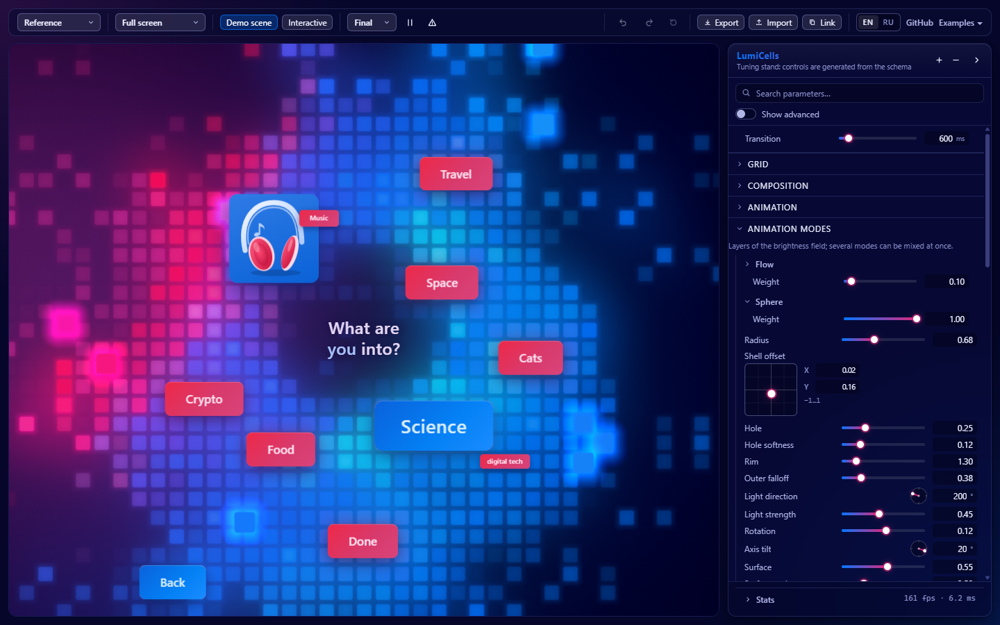

[English](README.md) | **Русский**

<h1 align="center">LumiCells</h1>

<p align="center">
  <b>Живой фон из неоновых пикселей для веба.</b><br />
  WebGL2 · 8 смешиваемых режимов анимации · реагирует на страницу · ноль зависимостей
</p>

<p align="center">
  <a href="https://supsad.github.io/lumicells/"></a>
</p>

<p align="center">
  <a href="https://supsad.github.io/lumicells/">
    
  </a>
</p>

Сетка светящихся ячеек складывается в кольца, сферы, волны, спирали, дождь или «жизнь» Конвея. У
пикселей аккуратное свечение, отдельные пиксели всплывают над плоскостью, а фон реагирует на
элементы страницы вокруг: баблы подсвечивают сетку своим цветом, клики пускают волны, наведение
поднимает пиксели.

Что входит в проект:

- **Ядро** (`lumicells`): класс `LumiCells`, TypeScript, ноль зависимостей.
- **React-обёртка** (`lumicells/react`): компонент `<LumiCells>` и хуки.
- **Web Component** (`lumicells/element`): тег `<lumi-cells>` для любого стека, в том числе
  чистого HTML.
- **Стенд** на Vite: ручки для всех параметров, пресеты, экспорт и импорт конфига, демо-сцена
  с баблами. Интерфейс на английском и русском (переключатель EN/RU или `?lang=ru`).

## Живое демо

**[supsad.github.io/lumicells](https://supsad.github.io/lumicells/)**: стенд с демо-сценой поверх
фона. Там можно переключать 9 пресетов, крутить любой параметр с плавными переходами, менять
размер сцены, включать отладочные слои, смотреть FPS и время кадра, экспортировать и
импортировать конфиг. Рядом опубликованы примеры
[Web Component](https://supsad.github.io/lumicells/examples/web-component.html) и
[ядро без фреймворков](https://supsad.github.io/lumicells/examples/core-basic.html).

<p align="center">
  
</p>

## Быстрый старт

> **npm-пакет скоро будет опубликован.** Пока его нет, соберите пакет из исходников (см.
> [До публикации в npm](#до-публикации-в-npm)). Пути импорта ниже совпадают с будущим пакетом.

Запустить стенд локально:

```bash
npm ci
npm run dev
```

Откроется стенд на `http://localhost:5173/`. Другие страницы:

| Адрес | Что там |
| --- | --- |
| `/` | Стенд с панелью настроек и демо-сценой |
| `/examples/web-component.html` | Web Component в чистом HTML, декларативная привязка через `data-lc-*` |
| `/examples/core-basic.html` | Ядро без фреймворков, вылет пикселей за границы карточки |
| `/examples/engine-harness.html` | Отладка движка: проходы по отдельности, замер времени кадра |
| `/examples/tune.html` | Детерминированное время для сравнения скриншотов |

### До публикации в npm

```bash
git clone https://github.com/supsad/lumicells.git
cd lumicells
npm ci
npm run build:lib   # dist/lib (ES-модули, IIFE-бандл, schema.json) и dist/types
npm pack            # lumicells-0.1.0.tgz
```

В своём проекте: `npm install ../lumicells/lumicells-0.1.0.tgz`, после этого импорты ниже
работают как написано. Для страницы без сборщика скопируйте `dist/lib/lumicells-element.iife.js`
и подключите его через `<script src>`.

## Подключение

### React

```tsx
import type { LumiCellsConfigInput } from 'lumicells';
import { LumiCells, useInfluence } from 'lumicells/react';
import { type ReactNode, useRef } from 'react';
import rawConfig from './lumicells.config.json';

const config = rawConfig as LumiCellsConfigInput;

export function Hero() {
  return (
    <LumiCells config={config} interactive style={{ height: '100vh' }}>
      <Bubble color="#ee2848">Путешествия</Bubble>
    </LumiCells>
  );
}

function Bubble({ color, children }: { color: string; children: ReactNode }) {
  const ref = useRef<HTMLButtonElement>(null);
  // Бабл подсвечивает пиксели под собой своим цветом и следует за своим положением.
  useInfluence(ref, { type: 'light', color, colorMix: 0.6, strength: 0.8 });
  return <button ref={ref}>{children}</button>;
}
```

Пропсы компонента: `preset`, `config`, `transition`, `paused`, `interactive`, `overflow`,
`priority`, `renderer`, `look`, `lookOffset`, `fallback`, `onReady`, `onError`, `onStats`, `ref`
и обычные атрибуты `div`. Порядок слияния: дефолты, затем пресет, затем `config`. Объект `config` можно создавать на каждом рендере:
компонент сравнивает содержимое, а не ссылку.

Хуки:

| Хук | Зачем |
| --- | --- |
| `useLumiCells()` | Экземпляр `LumiCells` из ближайшего компонента. `null` только на сервере, до монтирования и после размонтирования. Без WebGL2 экземпляр всё равно отдаётся: проверяйте `instance.supported` или используйте проп `fallback` |
| `useInfluence(ref, opts)` | Превращает элемент в источник света, тени или подъёма пикселей, возвращает ref на его хэндл |
| `useModulator(path, source, opts)` | Ведёт числовой параметр от значения, функции или объекта с `get()` |
| `usePulse()` | Стабильная функция для запуска волны |
| `useLumiCellsStats()` | Статистика кадра, обновляется 4 раза в секунду |
| `useLumiCellsEvent(type, handler)` | Подписка на событие экземпляра |

Компонент рендерится на сервере (SSR) статичным постером, WebGL создаётся только в браузере.

Требуется React 19: `ref` передаётся обычным пропом. Проп `fallback` показывается при
`no-webgl2` и `compile`, а при временной потере контекста исчезает сразу после восстановления.
Ожидание контекста из бюджета страницы (причина `budget`) его не показывает: хватает постера.

### Web Component

```html
<script type="module">
  import 'lumicells/element/define';
</script>

<lumi-cells id="bg" preset="reference" interactive style="height: 100vh">
  <button data-lc-influence data-lc-color="#0481f5" data-lc-pulse="click" data-lc-lift="hover">
    Наука
  </button>
</lumi-cells>

<script type="module">
  // Конфиг задаётся свойством или загружается из файла через атрибут src.
  document.getElementById('bg').config = { modes: { sphere: { radius: 0.7 } } };
</script>
```

Без сборщика подключается одним файлом `dist/lib/lumicells-element.iife.js`, он регистрирует тег
и кладёт API в глобальный `LumiCells`.

Атрибуты элемента: `preset`, `src` (URL файла конфига), `interactive`, `overflow`, `paused`,
`transition`, `priority`, `renderer`, `look`, `look-offset`. Свойства: `config`, `preset`, `src`,
`paused`, `interactive`, `overflow`, `transition`, `priority`, `renderer`, `look`, `lookOffset`,
`instance` (только чтение).

Декларативная привязка дочерних элементов:

| Атрибут | Значение |
| --- | --- |
| `data-lc-influence` | Элемент влияет на фон. Значение (или `data-lc-type`) задаёт тип: `light` (по умолчанию), `shadow`, `lift`, `seed`, `repel` |
| `data-lc-color`, `data-lc-color-mix` | Цвет подсветки и доля его смешения с палитрой |
| `data-lc-strength`, `data-lc-falloff`, `data-lc-padding`, `data-lc-priority` | Сила, мягкость края в клетках, отступ в px, приоритет |
| `data-lc-track` | `auto` или `frame`: как часто перечитывать положение |
| `data-lc-pulse` | `click` или `hover`: волна от элемента |
| `data-lc-lift` | `hover` или `click`: подъём пикселей у элемента |
| `data-lc-for="bg"` | Привязать элемент вне тега (например, из портала) к `<lumi-cells id="bg">` |

События: `lc-ready`, `lc-config`, `lc-stats`, `lc-error`, `lc-fallback`, `lc-contextlost`,
`lc-contextrestored` (конец fallback с причиной `context-lost`: анимация вернулась) и
`lc-renderer` (смена рендерера).

### Без фреймворков

```ts
import { LumiCells } from 'lumicells';

const cells = new LumiCells(document.querySelector<HTMLElement>('#hero')!, { preset: 'reference' });

const bubble = document.querySelector('#bubble')!;
cells.bindElement(bubble, { type: 'light', color: '#ee2848', colorMix: 0.6 });
bubble.addEventListener('click', (e) => {
  const { clientX, clientY } = e as MouseEvent;
  cells.pulse({ x: clientX, y: clientY, space: 'client' });
});

// Плавно поменять параметр за 800 мс.
cells.set('modes.sphere.radius', 0.5, { transition: 800 });

// Освободить WebGL-контекст.
cells.destroy();
```

## Конфигурационный файл

Стенд экспортирует `lumicells.config.json`:

```json
{
  "$schema": "./lumicells.schema.json",
  "version": 1,
  "extends": "reference",
  "grid": { "count": 36, "gap": 0.25 },
  "color": { "palette": ["#f21239", "#6a3cc8", "#0476ff", "#19e6d0"] }
}
```

- Файл можно сохранить полностью или только разницей относительно пресета (`extends`). Полный
  файл не поменяется, если позже изменятся дефолты библиотеки.
- `lumicells.schema.json` собирается вместе с пакетом (`lumicells/schema.json`) и скачивается со
  стенда, редактор по нему подсказывает поля и диапазоны.
- `normalizeConfig(raw)` никогда не бросает исключение: чинит типы, обрезает диапазоны, выкидывает
  неизвестные ключи и возвращает список замечаний с путями. `validateConfig(raw)` строже и
  подходит для проверки в CI.
- Кроме JSON стенд отдаёт готовые сниппеты для TypeScript, React и HTML.

## Стенд

Панель справа строится из схемы параметров автоматически. Каждая ручка показывает подсказку и
путь в конфиге, двойной щелчок по названию возвращает значение пресета.

- Сверху: пресет, размер сцены (весь экран, карточка 360×360, баннер 1200×320, телефон 390×844,
  свой размер), демо-сцена, интерактив, отладочные слои (поле, ореол, bloom, дымка, ячейки),
  пауза, имитация потери контекста, язык интерфейса.
- История изменений, автосохранение, ссылка с конфигом в адресе.
- **Экспорт**: JSON полностью или разницей, TypeScript, React, HTML, JSON Schema.
- **Импорт**: файл или вставка текста, с разбором ошибок.
- Статистика: FPS, время кадра на CPU и GPU, уровень качества, число пикселей и ячеек.

Горячие клавиши: `H` панель, `P` пауза, `D` отладочный слой, `Ctrl+Z` / `Ctrl+Shift+Z` история.

## Привязка к окружению

Фон знает о том, что происходит вокруг, через четыре механизма.

**Влияния** (`bindElement`, `addInfluence`). Прямоугольник со скруглением или круг, который
добавляет свет (`light`), затемняет (`shadow`, например под заголовком для читаемости), поднимает
пиксели (`lift`), сеет «жизнь» (`seed`) или отталкивает узор (`repel`). Влияний может быть сколько
угодно: в шейдер попадают 64 самых важных по приоритету и площади, остальные ждут, смена идёт
плавно.

```ts
const h = cells.bindElement(el, { type: 'light', color: '#0481f5', strength: 0.8, track: 'auto' });
h.update({ strength: 1.3 }); // при наведении
h.dispose();
```

Режимы слежения `track`:

- `auto` читает положение, только пока элемент может двигаться (resize, scroll, CSS-переходы,
  Web Animations);
- `frame` читает каждый кадр;
- `manual` не трогает DOM, координаты передаёт ваш код через `update({ x, y, w, h })`.

Элементы, которые двигает JS, лучше анимировать в `onBeforeFrame` из `lumicells`, тогда подсветка
не отстаёт даже на кадр.

**События** (`pulse`, `lift`). Разовая волна из точки и подъём пикселей в точке.

**Модуляции** (`modulate`). Любой числовой параметр можно вести от внешнего источника: числа,
функции или объекта с `get()`. Режимы: `add`, `mul`, `override`, `max`, со сглаживанием.
Модуляции живут только в рантайме и не попадают в сохранённый конфиг, поэтому не спорят со
стендом.

```ts
// Радиус сферы растёт, пока баблы летят.
const m = cells.modulate('modes.sphere.radius', () => flying * 0.1, {
  blend: 'add',
  smoothingMs: 150,
});

// Внешняя энергия, например уровень звука.
cells.setEnergy(1.4);
```

**Координаты.** `space` бывает `host` (CSS px от угла контейнера), `client` (px окна, как у
`PointerEvent`), `norm` (0..1 контейнера) и `cells` (клетки сетки).

**События экземпляра.** `cells.on(type, handler)` возвращает функцию отписки. Типы: `ready`,
`frame`, `stats`, `resize`, `config`, `quality`, `warn`, `error`, `fallback`, `renderer`,
`contextlost`, `contextrestored`, `destroy`.

## Режимы анимации

Режимы смешиваются как слои с весами (`animation.blend`: `screen`, `add` или `max`), смена режима
идёт плавным перетеканием весов.

| Режим | Что делает |
| --- | --- |
| `sphere` | Вращающаяся сфера с тёмной сердцевиной и ярким ободком |
| `flow` | Течение шума, «живые» пятна |
| `pulse` | Дыхание и концентрические волны из точки |
| `wave` | Направленные волны и интерференция |
| `ripple` | Капли дождя, расходящиеся круги |
| `vortex` | Спиральные рукава |
| `life` | Клеточный автомат Конвея и его варианты с плавным угасанием |
| `rain` | Падающие колонки |

Поверх режимов работают мерцание, редкие искры, разреженность окраин, внешняя энергия и свечение
в три слоя: узкий ореол вокруг ячейки, мягкий bloom и широкая дымка. Палитра от 1 до 32 цветов,
смешение в OKLab, линейно или ступенями.

**Всплывающие пиксели** (`lift`). Часть ячеек поднимается над сеткой: пружинный подъём,
покачивание, мягкая посадка с небольшой волной. Стиль `pop` поднимает пиксель на месте. Стиль
`float` отрывает его и уводит вверх. Если задать `render.overflow` (запас в px), пиксели и
свечение могут вылетать за границы контейнера.

**Пресеты**: `reference` (по умолчанию), `orb`, `pulse`, `life`, `vortex`, `waves`, `ripples`,
`rain`, `minimal`.

<p align="center">
  
</p>

## Производительность

- Вся процедурная математика считается в разрешении сетки: один тексель на ячейку, это тысячи
  точек, а не миллионы. На полном разрешении работает один проход композиции и инстансы
  всплывающих пикселей.
- Форма ячейки (скругление, ореол, горячее ядро) запекается в маленький штамп размером с шаг
  сетки, поэтому композит не считает SDF и экспоненты на каждый пиксель. Bloom и дымка сведены в
  одну текстуру.
- Все экземпляры на странице работают от одного `requestAnimationFrame`. Кадр делится на фазы:
  анимации приложения, чтение DOM, работа с GPU.
- Запуск не замораживает страницу даже при первом визите с пустым кэшем шейдеров. Шейдеры
  компилируются в фоне (`KHR_parallel_shader_compile`), а вид компилирует только те режимы
  анимации и цветовые эффекты, которые использует. В Windows (ANGLE поверх Direct3D 11) у
  каждого тяжёлого шейдера один выход, поэтому он компилируется в фоновом потоке, а не в потоке,
  который собирает кадр страницы, и каждая программа один раз рисуется вне экрана до первого
  видимого кадра. На десктопе в новом профиле браузера стенд показывает первый кадр примерно через
  1.1 с вместо примерно 6 с, а самая долгая задача главного потока сократилась примерно с 2.5 с до
  менее чем 0.1 с.
- Если позже включить режим, шумовое отображение цвета или искажение палитры, в фоне
  компилируется ещё один шейдер. Пока он не готов, картинка остаётся в точности прежней, затем
  изменение плавно проявляется за весь переход: он начинается позже на время компиляции
  (несколько сотен миллисекунд на Direct3D). На Direct3D первое использование такого шейдера к
  тому же останавливает кадры страницы примерно на 0.1–0.2 с, пока драйвер готовит его в потоке,
  который собирает кадр страницы; когда браузер закэшировал шейдер, этого больше не происходит.
- Разрешение ограничено `render.maxDpr` и бюджетом пикселей `render.maxPixels` (на тач-устройствах
  не больше 2.4 Мпикс).
- Адаптивное качество узнаёт частоту дисплея (60, 120, 144 Гц и выше) по кадрам без работы GL:
  пока компилируются первые фоны страницы (при необходимости их первая отрисовка ждёт ещё
  несколько кадров, около 25 мс при 165 Гц, под постером), а также после возврата на вкладку и
  смены плотности пикселей (масштаб, перенос окна на дисплей с другим DPR). Поэтому GPU, который
  медленный с самого первого кадра, не принимается за более медленный дисплей. Если дисплей стал
  медленнее без новой калибровки (монитор с тем же DPR, режим питания ОС), это видно по ритму
  кадров, как только время GPU или уже сделанные шаги показывают, что темп задаём не мы. При нехватке времени качество и разрешение ступенчато
  снижаются, с гистерезисом. Фризы главного потока и ограничение частоты кадров системой оно не
  путает с медленным GPU, а шаг, который не сократил ни опоздания кадров, ни время GPU,
  откатывается (значит, стоимость не зависит от пикселей). Уровни: `high` полная картинка,
  `medium` дешевле выборка свечения, `low` без ореола и фаски и с облегчённым конвейером
  свечения (см. [Снижение стоимости](#снижение-стоимости)).
- Фон останавливается, когда вкладка скрыта или контейнер вне экрана. При
  `prefers-reduced-motion` анимация замедляется, а всплывающие пиксели выключаются полностью,
  включая вызовы `lift()` (можно отключить через `render.reducedMotion: 'ignore'`).
- В кадре не создаются объекты и массивы, uniform-буферы загружаются только при изменениях.
- Размер: приложение, которое импортирует только `LumiCells`, получает около 79 КБ gzip (69 КБ
  brotli) после минификации, бандл для обычного тега `<script>` около 84 КБ gzip. Шейдеры
  минифицируются при сборке, подписи схемы не входят в рантайм. Бюджет проверяет `npm run size`.
- Замер на десктопе (RTX 5090, 165 Гц): 1920×1080 около 0.04 до 0.06 мс GPU и 0.1 мс CPU на
  кадр, 3840×2160 около 0.08 мс GPU на `high`. На телефоне при DPR 3 разрешение ограничивается
  DPR 2 и бюджетом пикселей. На реальных мобильных GPU замеров пока не было: архитектура
  рассчитана на них, но цифры стоит проверить на целевых устройствах через статистику стенда.

По умолчанию крупные фоны получают свой WebGL-контекст, а остальные делят один общий. Как
LumiCells выбирает рендерер и ограничивает число контекстов, описано в разделе
[Много фонов на одной странице](#много-фонов-на-одной-странице).

## Много фонов на одной странице

Браузер оставляет странице около 16 WebGL-контекстов (на телефонах меньше). Сверх этого он молча
убивает самый старый: это может быть главный фон страницы или WebGL самого приложения (карты,
three.js). Поэтому LumiCells не даёт каждому фону свой контекст: он выбирает рендерер для каждого
экземпляра и держит число контекстов на странице небольшим, сколько бы ни было фонов.

### Рендереры

По умолчанию (`renderer: 'auto'`) каждый экземпляр выбирает один из двух рендереров:

- **Свой контекст** для крупных фонов: canvas от 0.5 мегапикселя (в пикселях устройства, вместе с
  запасом `render.overflow`) или от четверти окна. Hero или фон на весь экран рисуют прямо в свой
  canvas: копия на каждый кадр не нужна, а потеря контекста в другом месте страницы их не задевает.
- **Общий рендерер** для всех остальных: один WebGL-контекст на всех. Каждый экземпляр рисует в
  свою область одного canvas вне страницы, а оттуда кадр копируется в 2D-canvas в контейнере.

Поэтому страница с hero на весь экран и сотней карточек работает на двух контекстах: своём у hero
и общем.

- **Бюджет.** Своих контекстов не больше 4 на десктопе и 2 на тач-устройствах (`maxContexts`).
  Когда бюджет занят, крупный экземпляр `auto` рисует через общий рендерер, а не ждёт, и забирает
  свой контекст, как только он освободится. Среди крупных фонов, которые спорят за контексты,
  выигрывает более высокий `priority`, затем заметно больший размер. Экземпляр `auto`, даже с
  `priority: 'high'`, никогда не забирает контекст у видимого экземпляра с `renderer: 'own'`: он
  остаётся на общем рендерере. Чтобы контекст был гарантирован, задайте `renderer: 'own'` вместе
  с `priority: 'high'`.
- **Изменение размера.** Выбор пересматривается, когда меняется размер контейнера, окна, DPR или
  настройки рендера. Работает гистерезис (общий фон переходит на свой контекст с 1x порога, свой
  уходит в общий ниже 0.7x) и выдержка: переключение ждёт, пока размер простоит около секунды,
  поэтому перетаскивание ручки изменения размера через порог ничего не переключает. Пока
  рендерер меняется, на экране остаётся последний кадр, пока новый рендерер не нарисует свой.
- **Статистика и события.** `getStats().renderer` показывает рендерер в работе (`'own'` или
  `'shared'`), `getStats().rendererMode` показывает запрошенный. Событие `renderer`
  `{ renderer, previous, reason }` сообщает о каждом переключении после первого выбора, с
  причиной `'promote'`, `'demote'`, `'budget'` или `'explicit'` (`lc-renderer` у Web Component).

Задайте рендерер явно, если знаете лучше, чем размер:

- `renderer: 'own'` всегда берёт свой контекст и никогда не переключается. Подходит для фона,
  который не должен зависеть от общего контекста, или для фона среднего размера, которому не нужна
  копия. Когда бюджет занят, он ждёт на постере (`getStats().state` равен `'waiting'`, видимый шлёт
  `fallback` с причиной `'budget'`, а в консоли один раз появляется предупреждение).
- `renderer: 'shared'` никогда не берёт свой контекст, даже если фон крупный. Подходит, когда
  WebGL-контексты нужны самому приложению (карты, three.js), или чтобы держать несколько крупных
  фонов на одном контексте.

```ts
import { LumiCells } from 'lumicells';

// Настройки на всю страницу: до или после создания экземпляров (безопасно и на сервере).
LumiCells.configure({ maxContexts: 2, promoteArea: 1 });

const hero = new LumiCells(heroEl, { preset: 'reference', priority: 'high' }); // 'auto'
const card = new LumiCells(cardEl, { preset: 'orb' }); // маленький: общий рендерер
const map = new LumiCells(mapEl, { renderer: 'shared' }); // никогда не берёт свой контекст

hero.on('renderer', (e) => console.log(e.previous, '->', e.renderer, e.reason));
hero.getStats().state; // 'pending' | 'waiting' | 'live' | 'parked' | 'lost' | 'failed' | 'destroyed'
card.setRenderer('own'); // переключить работающий экземпляр ('auto' вернёт выбор политике)
```

В React это `<LumiCells renderer="own" priority="high">`, в HTML
`<lumi-cells renderer="own" priority="high">`. Без пропа или атрибута действует значение для всей
страницы.

| Параметр `LumiCells.configure()` | По умолчанию | Смысл |
| --- | --- | --- |
| `renderer` | `'auto'` | Рендерер экземпляров, созданных после вызова, если они не просят свой |
| `promoteArea` | `0.5` | Мегапиксели (пиксели устройства), с которых экземпляр `auto` предпочитает свой контекст; четверть окна подходит всегда |
| `maxContexts` | `'auto'` | Сколько своих контекстов одновременно: 4, на тач-устройствах 2. При уменьшении экземпляры `auto` с самым низким рангом сразу переходят на общий рендерер (`own` паркуются) |
| `parkAfterMs` | `10000` | Фон дальше примерно одного экрана дольше этого времени освобождает GPU и показывает постер; `Infinity` отключает парковку |
| `createPerFrame` | `1` | Сколько контекстов создаётся за кадр |
| `sharedBudget` | `'auto'` | Мегапиксели общего canvas: 4, на тач-устройствах 2. Сверх этого все общие фоны рисуются с пониженным разрешением |
| `secondaryMaxFps` | `'auto'` | Ограничение частоты кадров неактивных общих фонов: fps, `0` выключено, `'auto'` только когда нужно (см. [Снижение стоимости](#снижение-стоимости)) |
| `lite` | `'auto'` | Облегчённый конвейер свечения общих фонов: `'auto'` для маленьких или многочисленных неактивных, `true` для всех неактивных, `false` никогда |

### Ленивое создание и парковка

- **Ленивое создание.** Конструктор ничего не создаёт на GPU. Контекст (или место в общем)
  запрашивается, только когда контейнер оказывается ближе примерно одного экрана от видимой
  области, и не больше одного контекста за кадр, поэтому монтирование длинного списка не
  подвешивает страницу: 100 экземпляров в одной задаче занимают на тестовом десктопе около
  20-25 мс главного потока при первой загрузке (около 15 мс с прогретым кешем кода). Внутри
  прокручиваемого элемента (карусель, лента чата) зона в Chrome и Edge 120+ выходит на один
  размер элемента за его видимую часть (IntersectionObserver `scrollMargin`). Другие браузеры
  создают там контекст, только когда фон прокрутили в видимую часть элемента, а остальное
  содержимое элемента считают далёким; в iframe с другого домена зона совпадает с видимой
  областью.
- **Парковка.** Фон, который дольше 10 секунд находится дальше этой зоны, освобождает контекст
  (или место в общем) и память GPU и показывает постер. При возврате он пересоздаётся; конфиг,
  твины и привязанные элементы сохраняются, заново засевается только автомат «Жизнь».
- Экземпляры с `render.pauseOffscreen: false` (например, источник вне экрана, который копируют в
  другие canvas) создаются сразу, не паркуются и где бы ни находились считаются видимыми.

### Подробности общего рендерера

- Конфиг, указатель, влияния, волны, всплывающие пиксели, события, отладочные виды и уровни
  качества работают у каждого экземпляра так же, как со своим контекстом. `canvas` возвращает
  2D-canvas, а `ready` приходит после первой копии.
- Область получают только фоны на экране. Если им нужно больше пикселей, чем `sharedBudget`, все
  они рисуются с пониженным разрешением: сетка и размер клеток сохраняются, падает только
  резкость, ни один фон не выпадает. Коэффициент округляется вниз до целого размера клетки в
  пикселях, но не меньше 3 пикселей устройства: фоны с такими мелкими клетками сохраняют своё
  разрешение.
- Припаркованный фон отдаёт свой слот и уменьшает 2D-canvas до 0×0, потому что Safari ограничивает
  память всех canvas на странице.
- Потеря общего контекста задевает все общие фоны. Каждый сохраняет последний кадр (без постера),
  получает `contextlost`, а после пересоздания контекста `contextrestored`.
- Каждый фон, который показывает кадр, тратит свою работу GPU плюс один `drawImage`, поэтому
  время кадра растёт с числом анимируемых фонов; сотню фонов плавными держит
  [снижение стоимости](#снижение-стоимости). `getStats()` показывает `presentMs` (копия этого фона
  с его долей снимка атласа за кадр) и `shared` (размер атласа, стоимость отрисовки и копий, долю
  снимка в стоимости копий и калибровку стоимости копии на мегапиксель, которая измеряется
  заново при смене размера атласа или масштаба бюджета). У общего фона `gpuMs` означает время GPU
  всего общего устройства.

### Снижение стоимости

Сотня анимированных карточек стоит сотни отрисовок и копий в каждом кадре. Общий рендерер
урезает эту работу там, где на фон не смотрят пристально, и решает заново в каждом кадре:

- **Пониженная частота кадров.** Фон активен, пока над ним указатель, около секунды после волны,
  всплывающего пикселя, сдвинутого или изменённого влияния, перехода конфига или изменения
  модулированного значения. Активные фоны работают с полной частотой, как и самый большой из
  рисующих, в каком бы состоянии он ни был. Остальные показывают каждый n-й кадр дисплея, равномерно распределённые по
  кадрам (при n = 2 половина на чётных кадрах, половина на нечётных), поэтому нагрузка на кадры
  одинаковая. Время их анимации идёт дальше: кадров меньше, но анимация не замедляется, и при
  смене частоты ничего не скачет. С `secondaryMaxFps: 'auto'` (по умолчанию) это включается только
  когда нужно: больше 8 рисующих общих фонов (не больше 60 fps и не больше половины частоты
  дисплея) или страница не укладывается в бюджет кадра по главному потоку или GPU (около 30,
  затем 15 fps; на 60 Гц 30 fps уже даёт многолюдность, поэтому шаг по бюджету ведёт сразу к
  15 fps, а на дисплее 30 Гц последний шаг 10 fps), и отпускается, когда бюджет позволяет. Число
  задаёт предел в fps (округляется до целого делителя частоты дисплея), `0` выключает.
- **Облегчённый конвейер.** Неактивные общие фоны меньше примерно 0.15 мегапикселя, а когда рисуют
  больше 12 фонов, то все неактивные, размывают bloom и дымку внутри одного прохода свечения в
  разрешении сетки: 2 прохода свечения вместо 5. Здесь важна только активность, поэтому самый
  большой фон тоже рисуется облегчённо, если он неактивен и достаточно мал (частота у него
  остаётся полной). На тестовом десктопе картинка отличается от полного конвейера не больше чем
  на 3 уровня из 255 (в среднем на 0.1-0.2). Фоны со своим контекстом используют его только на
  адаптивном уровне `low`.
- **Стоимость копий.** Когда стоимость копии на мегапиксель измерена, копии кадра могут занимать
  четверть кадра. Где копировать дорого (программный 2D-canvas, слабое устройство), частота
  кадров неактивных фонов снижается дальше, а ниже 15 fps уменьшается бюджет пикселей общего
  canvas (но не меньше четверти того, что нужно фонам).

`getStats().reducers` показывает, что действует на экземпляр (`{ lite, frameDivisor }`), а
`getStats().shared.reducers` общее состояние страницы: делитель частоты `frameDivisor` и уровень
`level`, причину `reason` (`'off'`, `'fixed'`, `'crowd'`, `'budget'` или `'copy'`), сколько фонов
работают с пониженной частотой и облегчённо, интервал кадров дисплея, с которым идёт расчёт, и
сниженный `copyBudget`, если он есть.

Стресс-стенд, 100 карточек 130×80 px на одном экране (Chrome, RTX 5090, 165 Гц; главный поток и
GPU на кадр):

| | До | После |
| --- | --- | --- |
| CPU ×1 | 114 fps, p95 12.2 мс, 1.4 мс, GPU 4.2 мс | 165 fps, p95 6.2 мс, 0.6 мс, GPU 1.2 мс |
| CPU ×4 | 81 fps, p95 18.2 мс, 6.6 мс, GPU 3.6 мс | 163 fps, p95 6.2 мс, 2.1 мс, GPU 0.7 мс |
| DPR 2, CPU ×4 | 70 fps, p95 18.3 мс, 8.0 мс, GPU 4.3 мс | 164 fps, p95 6.2 мс, 2.3 мс, GPU 0.6 мс |

Одна или четыре карточки работают как раньше (165 fps), а карточка под указателем остаётся на
165 fps с полным конвейером.

### Одинаковые карточки

Список карточек с одним конфигом анимирует сотню копий одной и той же картинки. С
`look: 'shared'` (включается явно: меняет вид страницы) карточки, чей конфиг рисует одну и ту же
картинку, делят её между собой: она рисуется один раз за кадр, и каждая карточка показывает свою
часть.

```ts
new LumiCells(cardEl, { preset: 'orb', look: 'shared' });
new LumiCells(otherEl, { preset: 'orb', look: 'shared', lookOffset: 0.25 }); // не синхронно
```

В React это `<LumiCells look="shared">`, в HTML `<lumi-cells look="shared" look-offset="0.25">`.

- **Одна картинка.** Карточки делят картинку, когда их конфиги совпадают с точностью до
  `interaction`, `render.pauseOffscreen` и `transition`: сами по себе они кадр не меняют. Все
  карточки группы анимируются синхронно; `lookOffset` (от 0 до 0.5) сдвигает окно каждой карточки
  на долю её размера, на целые клетки и от сида экземпляра, чтобы соседи не показывали одни и те
  же клетки (группа рисуется на столько же больше: при большом сдвиге видно больше окраин
  картинки). Клетки при этом сохраняют размер, который у карточки был бы свой, и с
  `grid.sizing: 'count'` тоже.
- **Обрезка, а не масштаб.** Карточка показывает ту часть общей картинки, которую покрывает её
  canvas, в своём масштабе пикселей: в группе одинаковых карточек каждая показывает ровно то, что
  нарисовала бы сама. Карточки разного размера делят картинку, только если клетки у них выходят
  одного размера (`grid.sizing: 'pitch'` или `'count'` с той же короткой стороной). У меньшей или
  сдвинутой карточки клетки стоят там же, где она нарисовала бы их сама, но узор рассчитан на
  размер группы, а с `render.overflow` в её полях видны клетки группы. Нарисовав первый кадр,
  группа больше не меняет размер: пришедшая позже карточка покрупнее получает свою картинку, а при
  уходе самой большой карточки группа сохраняет размер, так что картинка одной карточки не
  меняется, когда приходит или уходит другая.
- **Выход и возврат.** Карточка выходит из группы, как только рисует что-то своё: свет или подъём
  под указателем (`interactive`), волну от клика или `pulse()`, влияние или привязанный элемент,
  `lift()`, модулятор, `setEnergy()`, изменение конфига или отладочный вид. Она продолжает общую
  картинку в своей области с тем же временем, клетками и поднятыми клетками (автомат «Жизнь»
  пересевается; узор карточки меньше группы или сдвинутой в ней раскладывается под её собственный
  размер) и возвращается примерно через 2 секунды после того, как всё это закончилось,
  тогда её поднятые клетки сменяются клетками группы. `setLook('own')` выводит из группы сразу.
  GPU-ресурсы вернувшейся карточки какое-то время хранятся для следующей вышедшей, так что
  наведение указателя на карточки одну за другой не выделяет новые на каждую.
- **Рендереры и стоимость.** Общей картинке нужен общий рендерер: с `renderer: 'auto'` карточка
  остаётся на нём при любом размере, а `renderer: 'own'` важнее `look`. Группа считается один раз
  для атласа, бюджета пикселей и облегчённого конвейера и рисуется в каждом кадре, в котором её
  показывает хотя бы одна карточка. Частоту кадров каждая карточка получает своя, как раньше: она
  всё ещё платит за свою копию. Парковка, потеря контекста (каждая карточка сохраняет последний
  кадр) и статистика работают для каждой карточки как раньше.
- **Статистика и события.** В группе статистика карточки описывает то, что она показывает:
  уровень качества и масштаб группы, пиксели и клетки своей обрезки, поднятые клетки группы.
  Карточка, вошедшая в группу (или вышедшая из неё) на другом уровне, чем сообщила последним,
  получает событие `quality` с причиной `'look'`. `getStats().look` равен `'group'` или `'own'`, `getStats().groupSize`
  показывает, сколько карточек делят картинку; `getStats().shared.groups` считает картинки, а
  `.draws` области, нарисованные в последнем кадре. Событие `look`
  `{ look, previous, reason, groupSize }` (`lc-look` у Web Component) сообщает о входе и выходе с
  причиной `'join'`, `'layers'`, `'config'`, `'explicit'` или `'renderer'` (парковка или переход
  на свой контекст).

Стресс-стенд, 100 карточек 130×80 px (Chrome, RTX 5090, 165 Гц; главный поток и GPU на кадр,
областей нарисовано за кадр):

| | `look: 'own'` | `look: 'shared'` |
| --- | --- | --- |
| CPU ×1 | 164 fps, 0.9 мс, GPU 1.0 мс, 34 отрисовки | 165 fps, 0.3 мс, GPU 0.05 мс, 1 отрисовка |
| CPU ×4 | 161 fps, 2.3 мс, неактивные на 15 fps | 161 fps, 1.6 мс, неактивные на 55 fps |
| DPR 2, CPU ×4 | 160 fps, 2.6 мс, неактивные на 15 fps | 157 fps, 1.8 мс, неактивные на 55 fps |
| CPU ×4, все карточки каждый кадр | 67 fps, 8.0 мс, GPU 4.2 мс, 100 отрисовок | 109 fps, 2.3 мс, GPU 0.04 мс, 1 отрисовка |

В последней строке пониженная частота выключена (`secondaryMaxFps: 0`): от стоимости общей картинки
остаётся один `drawImage` на карточку за кадр и композиция браузером каждого изменившегося canvas.
Частоту неактивных карточек задаёт не общая картинка, а бюджет кадра (порог толпы около 55 fps,
бюджет может опустить её примерно до 15 fps), поэтому она зависит от загрузки машины: при повторном
замере под другой нагрузкой неактивные карточки обоих вариантов шли на 15 fps, а общая картинка
оставалась впереди по частоте кадров и времени главного потока (138 против 108–113 fps при CPU ×4).

## Как устроено

```
src/schema      схема параметров: типы, дефолты, валидация, пресеты, экспорт, JSON Schema (без DOM)
src/core
  controller    твины, модуляции, влияния, волны, всплывающие пиксели, адаптивное качество (без DOM и GL)
  engine        WebGL2: проходы life, field, bloom, stamp, composite, lift и GLSL-режимы
  dom           canvas и его размер, слежение за элементами, указатель
  lumi-cells.ts фасад LumiCells
src/react       компонент и хуки
src/element     Web Component
demo            стенд и демо-сцена
examples        страницы на чистом HTML и инструменты разработки
```

Схема параметров здесь единственный источник правды. Из неё выводятся тип конфига, пути для
`set` и `modulate`, дефолты, валидация, JSON Schema, раскладка uniform-буфера для GPU (макросы
`P_<путь>` в GLSL) и панель стенда. Тексты схемы по умолчанию на английском, русские лежат в
`src/schema/locales/ru.ts`.

### Как добавить параметр

1. Добавить рантайм-поле в `src/schema/schema.ts`, например
   `strength: num({ min: 0, max: 2, step: 0.01, default: 0.5, gpu: true })`.
2. Добавить английскую подпись и описание в `src/schema/meta.ts` по тому же пути, например
   `'glow.halo.strength': { label: 'Strength', description: '...' }`.
3. Добавить русский текст в `src/schema/locales/ru.ts` по тому же пути.
4. Использовать параметр в шейдере как `P_<путь_через_подчёркивания>`, например
   `P_glow_halo_strength`.

Типы, валидация, стенд, JSON Schema и экспорт подхватят параметр сами. Тесты упадут, если у пути
нет английского или русского текста. Подписи живут отдельно от рантайм-схемы, поэтому
приложение, которое только рисует фон, их не везёт.

### Как добавить режим анимации

1. Добавить группу режима в `modes` схемы и его id в `MODE_IDS`.
2. Написать функцию `vec3 mode_<id>(ModeIn m)` в `src/core/engine/glsl/modes/<id>.ts` и
   зарегистрировать её в `modes/index.ts`. Функция возвращает яркость, огибающую и акцент.
3. Если режиму нужна своя анимированная фаза, добавить её в `src/core/controller/clock.ts` и во
   FrameBlock.

## Поддержка браузеров

Нужен WebGL2: Chrome, Edge, Firefox, Safari 15 и новее. Без WebGL2, при потере контекста, до
первого кадра, а также пока экземпляр ждёт контекст или припаркован, показывается статичный
CSS-постер в цветах конфига. Если есть float-текстуры,
свечение считается в HDR, иначе в RGBA8 со сжатием.

## Скрипты

| Команда | Что делает |
| --- | --- |
| `npm run dev` | Стенд и примеры |
| `npm run build` | Проверка типов и сборка стенда в `dist-demo` |
| `npm run build:lib` | Сборка пакета в `dist/lib` и типов в `dist/types` |
| `npm run check:types` | Проверка типов собранного пакета глазами потребителя |
| `npm test` | Юнит-тесты |
| `npm run typecheck` | Проверка типов |
| `npm run lint` | Biome |
| `npm run test:e2e` | Сквозные тесты в браузере (Playwright, Chromium) |
| `npm run size` | Размер бандла потребителя против бюджета (после `npm run build:lib`) |

Перед первым e2e-запуском выполните `npx playwright install chromium`. Переключатели GPU, порта и
сервера описаны в `tests/e2e/support/env.ts`: CI рисует через SwiftShader, локальный запуск через
аппаратный GPU. Сквозные тесты проверяют жёсткие инварианты (ноль потерь контекста, бюджет
контекстов, все видимые карточки живые, нет утечек за 20 циклов монтирования, восстановление после
потери контекста, страницы паритета) и пишут тайминги в `test-results/e2e-perf.json`.

## Планы

- [ ] Опубликовать `lumicells` в npm.
- [ ] Выбрать и добавить открытую лицензию.
- [ ] Замерить производительность на реальных мобильных GPU.

## Лицензия

Пока не выбрана. Лицензия появится до публикации в npm, до этого код не лицензирован для
повторного использования.
