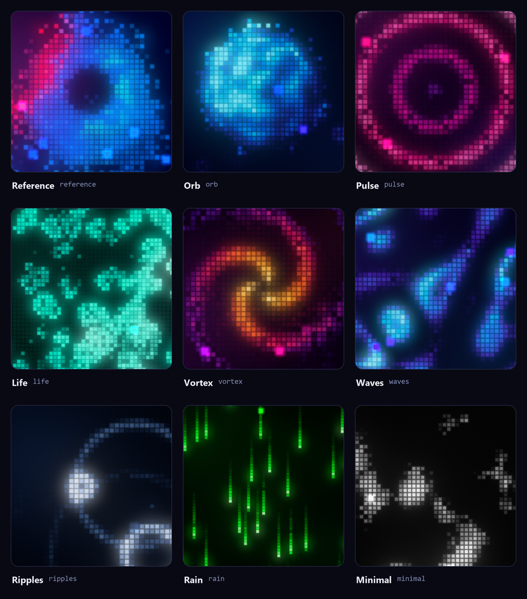

[English](../presets-and-modes.md) | **Русский**

[LumiCells](../../README.ru.md) › [Документация](README.md)

# Пресеты и режимы анимации

## Пресеты

  

`reference` (вид по умолчанию), `orb`, `pulse`, `life`, `vortex`, `waves`, `ripples`, `rain`,
`minimal`. Каждый пресет задаёт лишь небольшой патч поверх дефолтов, поэтому с него удобно
начинать свой конфиг: `{ "extends": "vortex", ... }` (см. [Конфигурационный файл](config.md)).

Пресет выбирается опцией `preset` у класса, пропом `preset` у React-компонента или атрибутом
`preset` у Web Component. Смена пресета анимируется, как любое другое изменение.

## Режимы анимации

Режимы смешиваются как слои с весами (`animation.blend`: `screen`, `add` или `max`), смена режима
идёт плавным перетеканием весов.

| Режим | Что делает |
| --- | --- |
| `sphere` | Вращающаяся сфера с тёмной сердцевиной и ярким ободком |
| `flow` | Течение шума, «живые» пятна |
| `pulse` | Дыхание и концентрические волны из точки |
| `wave` | Направленные волны и интерференция |
| `ripple` | Капли дождя, расходящиеся круги |
| `vortex` | Спиральные рукава |
| `life` | Клеточный автомат Конвея и его варианты с плавным угасанием |
| `rain` | Падающие колонки |

Как добавить свой режим, описано в разделе
[Как устроено](architecture.md#как-добавить-режим-анимации).

## Свечение и палитра

Поверх режимов работают мерцание, редкие искры, разреженность окраин, внешняя энергия (см.
[Модуляции](binding.md#модуляции)) и свечение в три слоя: узкий ореол вокруг ячейки, мягкий bloom
и широкая дымка.

Палитра от 1 до 32 цветов, смешение в OKLab, линейно или ступенями (`color.interpolation`:
`oklab`, `linear`, `steps`), 5 способов раскладки цвета (`color.mapping`: `spatial`, `radial`,
`angular`, `intensity`, `noise`).

## Всплывающие пиксели

**Всплывающие пиксели** (`lift`). Часть ячеек поднимается над сеткой: пружинный подъём,
покачивание, мягкая посадка с небольшой волной. Стиль `pop` поднимает пиксель на месте. Стиль
`float` отрывает его и уводит вверх, как пузырёк. Если задать `render.overflow` (запас в px),
пиксели и свечение могут вылетать за границы контейнера.

Подъём бывает и от страницы: наведение, вызовы `lift()` и влияния `lift` (см.
[Привязка к окружению](binding.md)). При `prefers-reduced-motion` всплывающие пиксели выключены
(см. [Производительность](performance.md#почему-кадр-дешёвый)).
